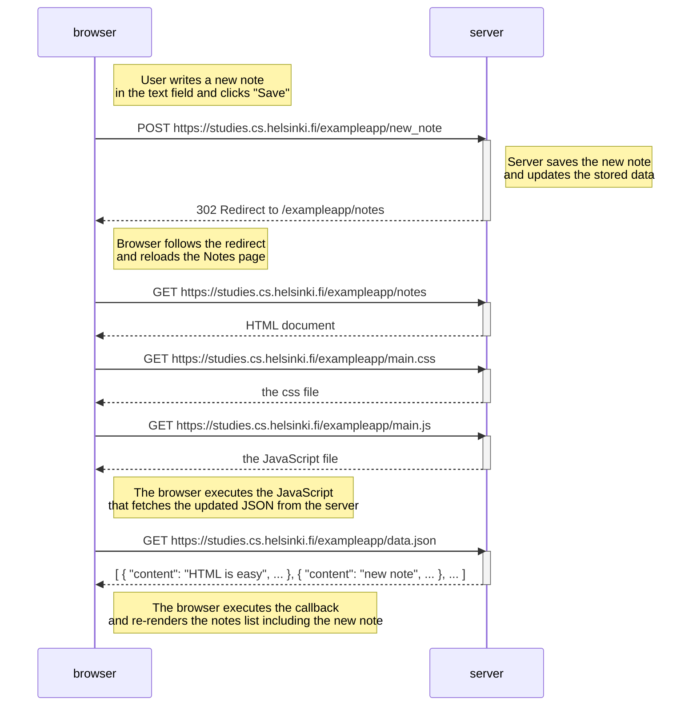

```mermaid
sequenceDiagram
    participant browser
    participant server

    Note right of browser: User writes a new note<br/>in the text field and clicks "Save"

    browser->>server: POST https://studies.cs.helsinki.fi/exampleapp/new_note
    activate server
    Note right of server: Server saves the new note<br/>and updates the stored data
    server-->>browser: 302 Redirect to /exampleapp/notes
    deactivate server

    Note right of browser: Browser follows the redirect<br/>and reloads the Notes page

    browser->>server: GET https://studies.cs.helsinki.fi/exampleapp/notes
    activate server
    server-->>browser: HTML document
    deactivate server

    browser->>server: GET https://studies.cs.helsinki.fi/exampleapp/main.css
    activate server
    server-->>browser: the css file
    deactivate server

    browser->>server: GET https://studies.cs.helsinki.fi/exampleapp/main.js
    activate server
    server-->>browser: the JavaScript file
    deactivate server

    Note right of browser: The browser executes the JavaScript<br/>that fetches the updated JSON from the server

    browser->>server: GET https://studies.cs.helsinki.fi/exampleapp/data.json
    activate server
    server-->>browser: [ { "content": "HTML is easy", ... }, { "content": "new note", ... }, ... ]
    deactivate server

    Note right of browser: The browser executes the callback<br/>and re-renders the notes list including the new note

```