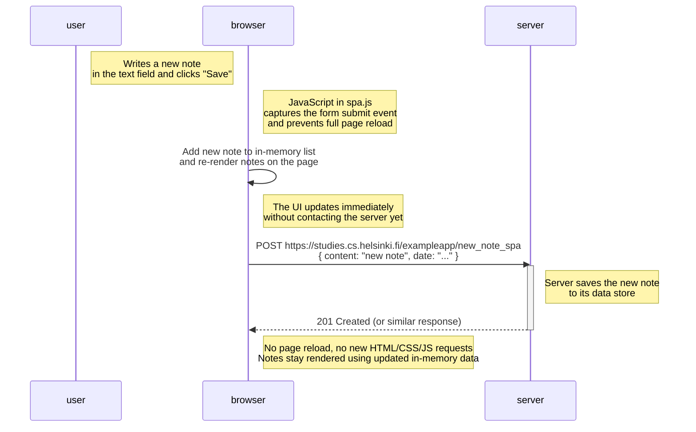

```mermaid
sequenceDiagram
    participant user
    participant browser
    participant server

    Note right of user: Writes a new note<br/>in the text field and clicks "Save"

    Note right of browser: JavaScript in spa.js<br/>captures the form submit event<br/>and prevents full page reload

    browser->>browser: Add new note to in-memory list<br/>and re-render notes on the page

    Note right of browser: The UI updates immediately<br/>without contacting the server yet

    browser->>server: POST https://studies.cs.helsinki.fi/exampleapp/new_note_spa<br/>{ content: "new note", date: "..." }
    activate server
    Note right of server: Server saves the new note<br/>to its data store
    server-->>browser: 201 Created (or similar response)
    deactivate server

    Note right of browser: No page reload, no new HTML/CSS/JS requests<br/>Notes stay rendered using updated in-memory data

```